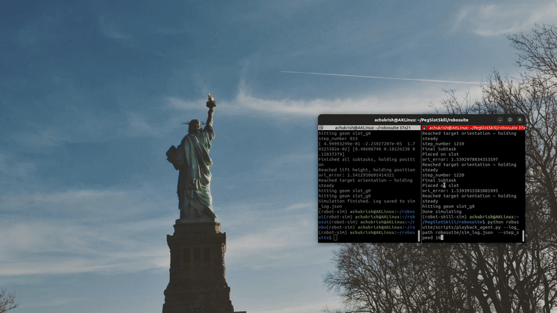

# PegSlotSkill
This repo is a supporting simulation software for peg slot skill which are used for data generation, testing and eval of robot skills learning. The current simulation architecture adopts Robosuite which can be supported by ,odular architectures like mimicgen for data generation purposes and robomimic for RL training. The repo also consists of an heurestic agent that can simulate the action purely based on adjustments and control.

## Installation steps:
The installation heirarchy will follow from creating a new conda env and installing all required repos induvidually:
1. Set up conda environment:l
```sh
conda create -c conda-forge -n robot-skills-sim python=3.10
```
2. Activate conda environment:
```sh
conda activate robot-skills-sim
```
3. Clone and setup robosuite dependency:

```sh
cd robosuite
pip install -e .
pip install -r requirements.txt
pip install -r requirements-extra.txt
```
(optional: if running into issues with numba/numpy, run: conda install -c numba numba=0.56.4 -y)

4. Re-Install Numpy and Numba versions (If faced with error):
```sh
pip install numpy==1.23.3 numba==0.56.4
```
## Custom Env Creation
If users want to create a custom env for separate tasks , follow the instructions below :
1. Add object stls into `robosuite/models/assets/objects/meshes` folder
2. Create respective object xml by following sample xml templates on the `robosuite/models/assets/objects` folder
3. Create Object classes inside `robosuite/robosuite/models/objects/xml_objects.py` referencing the xml file.
4. Call the Object class anywhere in the code to initialize it

**Note : All custom assets are convex hulls when loaded. If you want to ensure concavity perform convex decomposition**

### Convex Decomposition
Users can perform convex decomposition on convex hull stls using the following code
```sh
python robosuite/robosuite/models/assets/objects/convex_decomposition.py --mesh_path XXX/robosuite/robosuite/models/assets/objects/meshes/cuboid.stl
```
This will split into n meshes , where n can be passed as args. All these meshes can be used to create a new object xml.

## Teleoperation Skill
Users can teleop the robot + gripper using the following scripts which saves the recording as Hdf5 file consisting of states and observations required for RL and also mimicgen. The base saving format is robomimic.

Before running teleop ,users need to compile any new task that's being aded to set of registered task . This can be done using:
```sh
 python -m py_compile cube_place.py 
```
Now,we can run teleop on CubePlace Task
```sh
python robosuite/scripts/collect_human_demonstrations.py --device keyboard --environment CubePlace --robots PandaRobotiq --directory XXXX/PegSlotSkill/robosuite_data_2"
```
where XXX can be the directory user wants to save the data in. Users can choose from a list of tasks .

The teleop-ed data can be played back using a playback script borrowed from Robocasa. 
```sh
python robosuite/scripts/playback_dataset.py --dataset XXXX/robosuite_data_2/demo_2025-11-XXXX.hdf5  --use-actions --n 1
```
here `use-actions` is used to step the ennvironments with the actions stored in the H5 file. 

A sample teleop playback using actions


## Agent Simulation
We have created a simulated agent that's purely hurestics based. The task is subdivided into n subtasks for easier control and execution of this heurestics based controller. The final success condition checks for contact between peg_geom and slot_geom_0.

The created agent can be run using the following script:
```sh
python robosuite/scripts/playback_agent.py --log_path robosuite/sim_log.json
```
where users can control the following args : 
* `sim_speed` which controls the simulation update rate (default 0.002 in Mujoco)
* `step_speed` which controls the speed at which the simulation step loop runs in . Deault it has 0.1 delay,but can be made faster by passing a num value
* `episode_length` which controls the length of the entire episode ie; traj len

The following code opens a mujoco window and executes the agent controlled by OSC controller with every subtask mentioning the end effector goal pos. The file outputs `sim_log.json` which covers the following modalities:
* `commanded_robot_pos` : A 7D vector which has commanded robot poses [x,y,z,ax,ay,az,gripper_val]
* `gripper_pose_observed`: A 7D vector which has observed robot poses obtained from stepping the environment using the commanded values in [x,y,z,ax,ay,az,gripper_val]
* `peg_pos_commanded` : The commanded peg_pos obtained when env.reset() is called
* `hole_pos_commanded` : The commanded peg_pos obtained when env.reset() is called
* `success` : Whether the episode reached success conditions

The following videos were obtained when played in :
1. Deault `sim_speed` and `step_speed`

2. `step_speed` at 10 and default `sim_speed`

3. `sim_speed` at 0.005 and default `step_speed`


